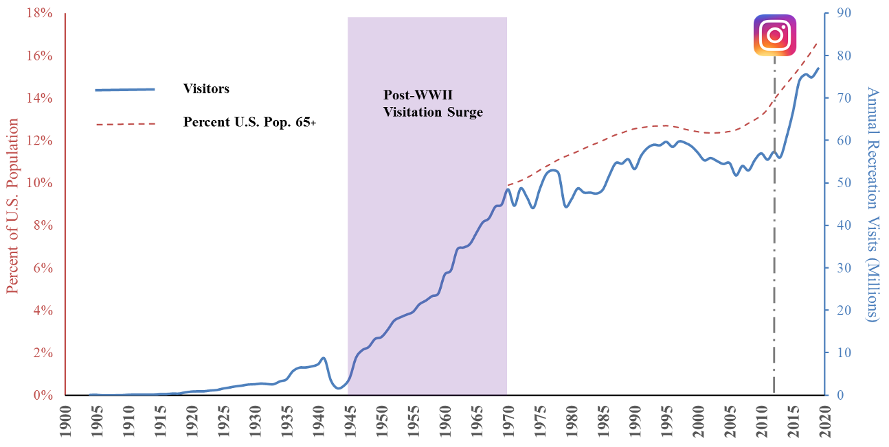
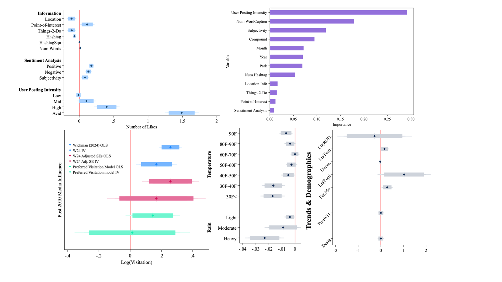
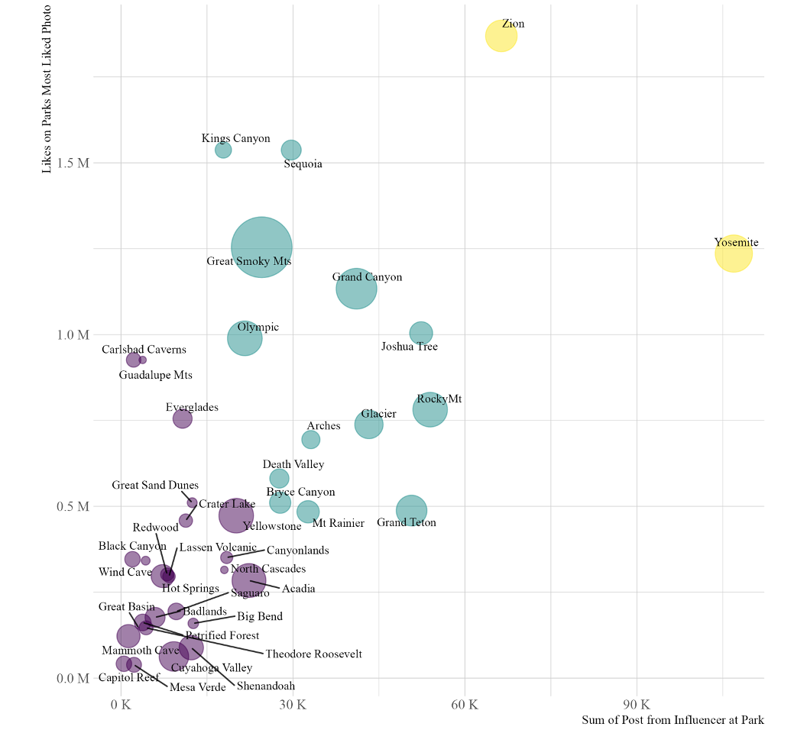
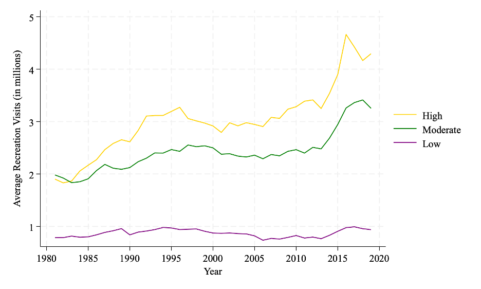
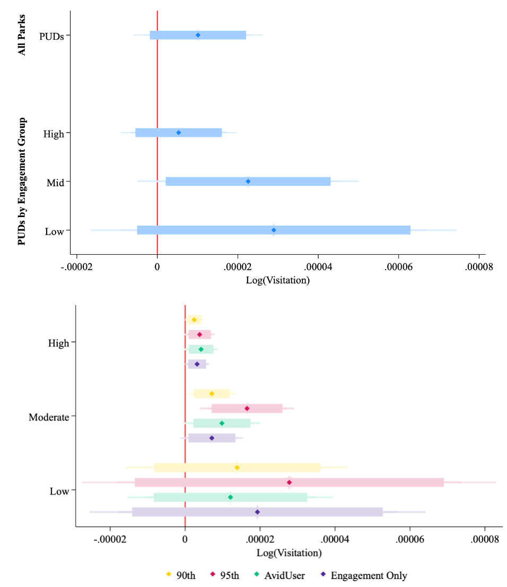

## NPS Publication Replications
# Is a Photo Worth 1,000 Likes? The Influence of Instagram at National Parks
###### [Ashley C. Lowe Mackenzie](https://loweas.github.io/) 
###### [Steven J. Dundas](https://sites.science.oregonstate.edu/~dundas/)

## Overview
This repository is to accompany the submission of *Is a Photo Worth 1,000 Likes? The Influence of Instagram at National Parks.* It contains data and code for the work. Some data is only available on request due to file size. 

#### Abstract / Summary Paragraph 
Recent increases in recreational visits, staffing shortages, and maintenance backlogs have left public land agencies in the United States (US) facing multiple stressors that affect their ability to manage land sustainably(1,2). One supposition by traditional media outlets is that social media is the culprit for recent increases in visits and resource degradation on public lands. We test the validity of such claims and investigate how online engagement with content and user behavior on Instagram may connect to visitation trends at US National Parks(3–7). Using millions of georeferenced Instagram posts, we find a small, positive effect (5 to 7%) on visitation due to viral content and the presence of influencers at parks with moderate and high social media exposure. National parks with high exposure to Instagram see visitation increases from viral content regardless of who posts it, while parks in the moderate group see increases only from posts by influencers. We do not find evidence of a contemporaneous effect on visitation based on the volume of content posted to each park location. Our results suggest any causal connection between social media and visitation to public lands is likely through a behavioral channel, such as herd behavior or the bandwagon effect.  

### Analysis Code
Replicates the various data visualizations across manuscrpit. Multiple Data analytic lanaguages where used.

1. [Fig. 1](Data_Publications/Data/AnnualSummaryReport.xlsx) ~ Use  Data/Annual Summary Report (1904 - Last Calendar Year) (3).xlsx

2. [Fig. 2](Data_Publications/Pictures/FrameworkInstagram.tiff) ~ Diagram Pictures/FrameworkInstagram.tiff

3. [Fig 3.a](Data_Publications/Analysis_Code/Figure3a.do) ~ Use /Analysis_Code/Figure3a.do. This file requires Stata. Use Data/Figure3a.dta. **Note the dataset is to large for github - request datasets for running this code**

4. [Fig 3.b](Data_Publications/Analysis_Code/figure3b.ipynb) ~ Use Analysis_Code/figure3b.ipynb. We use the Jupyter Notebook to generate Figure 3.b and the associated Extended Figure 3. This code implements a Random Forest machine learning algorithm to perform both classification and regression tasks. The model analyzes how various input variables influence predictive accuracy of the number likes, and the resulting importance matrix (also called the feature importance plot) highlights which variables contribute most to the model's performance. This allows us to identify the most influential predictors for like on each photo and to better understand the underlying drivers in the dataset.

5. [Fig 3.c](Data_Publications/Analysis_Code/Figure3c.do) ~  Use Analysis_Code/Figure3c.do. These regression are coded in stata and produce figure c and extend table 3.
7. [Fig. 4](Data_Publications/Analysis_Code/Cluster.R) ~ Use Cluster.R in R. Recreates Figure 4 and extend figure 4,5 and 7. It first begins with Extend figure 7 with the clustering using  DBSCAN to identify major outlies. Then Silloute to cluster on the remaining using a kmedians which is sensitive to outliers. Combining this imformation we produce Figure 4.

8. [Fig 5](Data_Publications/Pictures/Graph.gph) ~ Use Pictures/Graph.gph. Stata file to pull up graph of grouping parks

9. [Fig6](Data_Publications/Analysis_Code/Figure6.do) ~ Use Analysis_Code/Figure 6.do. Stata coefficient plots based on grouping from fig 4.

